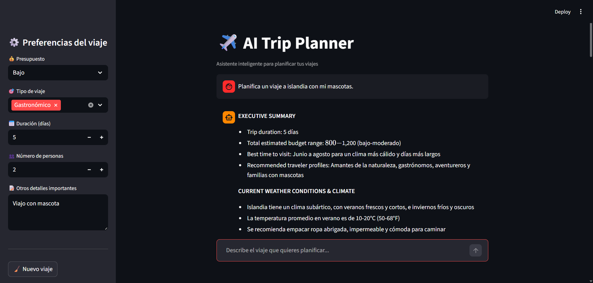
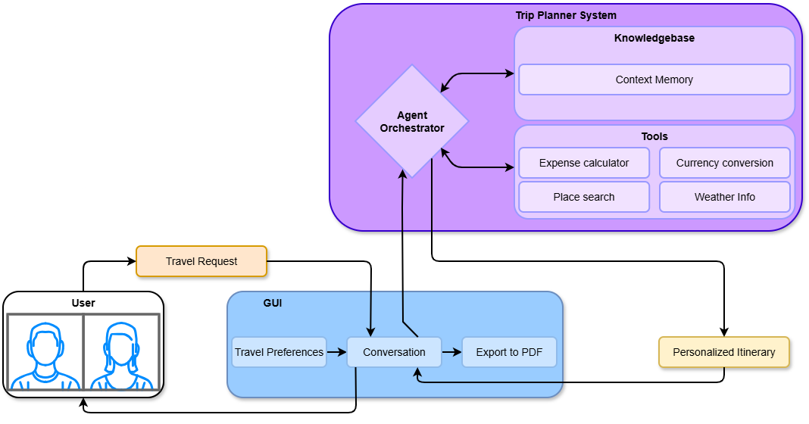

# ✈️ AI Trip Planner

AI Trip Planner is a **local AI-powered travel planning application** with a conversational interface.
Users can describe a trip, select preferences, and receive a structured itinerary generated by an AI agent, with the option to export the result as a PDF.

---

## 🎯 Project Purpose

This project was built to demonstrate how an **AI agent can be integrated into a real user-facing application**, focusing on usability rather than pure model experimentation.

The emphasis is on:

* Clear interaction flow
* Preference-driven responses
* Context-aware reasoning
* Practical, exportable results

---

## 🚀 Main Features

* Conversational travel planning
* Travel preferences (budget, trip type, duration, etc.)
* Always includes an **“Other”** option for flexibility
* Context-aware AI responses
* PDF export of the final itinerary
* Clean interface with no technical noise exposed to the user

---

## 🧭 How It Works

1. The user submits a travel request
2. Preferences are selected from the interface
3. An AI agent processes the request using context and tools
4. A formatted travel plan is generated
5. The result can be exported as a PDF

This diagram represents the **user-level behavior of the system**, not low-level implementation details.

---

## 🏗️ Project Structure

AI_Trip_Planner

* main.py — FastAPI app and AI logic
* streamlit_app.py — Streamlit user interface
* models.py — Data models
* requirements.txt — Project dependencies
* GUI/gui.png — Application UI screenshot
* Diagrama.png — Conceptual system diagram

---

## ▶️ Running the Project

The application runs locally:

* Start the API with:
  `uvicorn main:app --host 0.0.0.0 --port 8000 --reload`

* Start the interface with:
  `streamlit run streamlit_app.py`

---

## 🧪 Example

User request:
“Plan a 7-day trip to Peru with a medium budget and cultural focus.”

Output:

* Day-by-day itinerary
* Practical travel tips
* Structured AI response
* Downloadable PDF

---

## 👤 Author

Personal portfolio project focused on:

* Applied Artificial Intelligence
* Python development
* System design
* User experience

